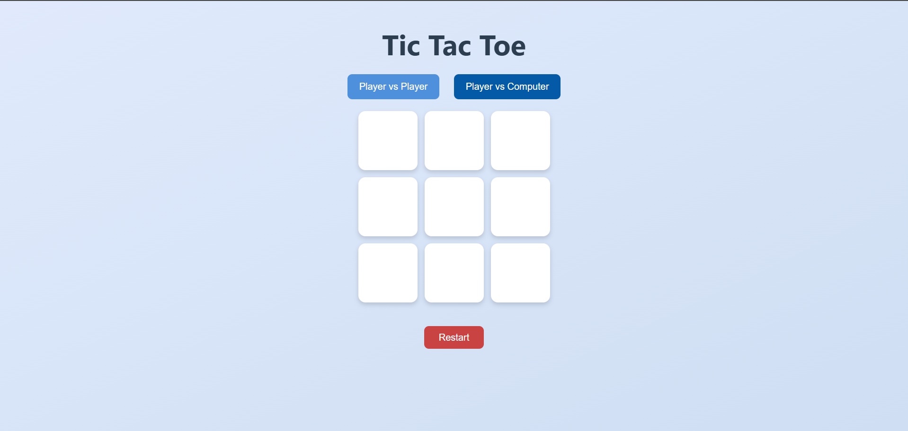
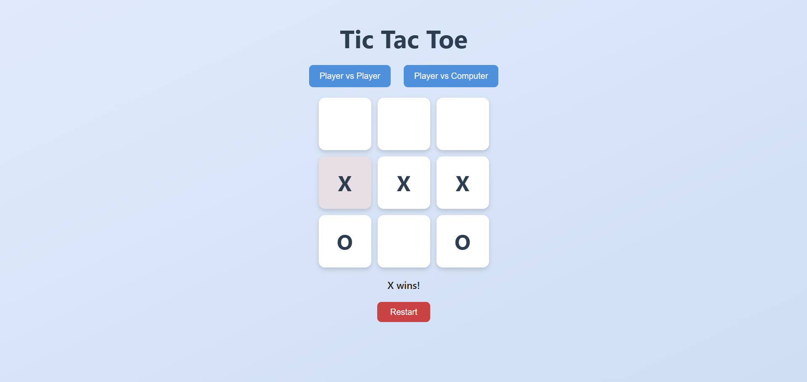
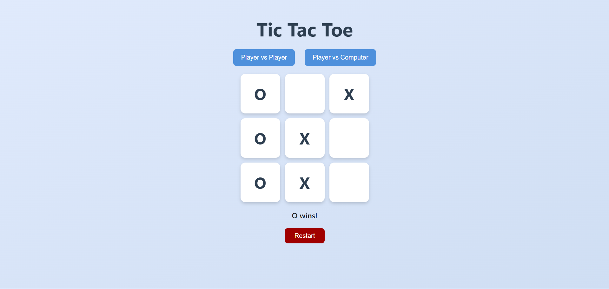

# 🎮 Tic Tac Toe Game (with PvP & PvC Modes)

A simple and elegant **Tic Tac Toe** web game built using **HTML, CSS, and JavaScript**, featuring:

- ✅ Player vs Player mode
- ✅ Player vs Computer mode (random AI)

---

## 🚀 Features

- 🧑‍🤝‍🧑 **Player vs Player**: Two players can take turns on the same screen.
- 🤖 **Player vs Computer**: Play against a basic AI that makes random moves.
- ✨ **Modern UI**: Beautiful, responsive design with smooth interactions.
- 🔄 **Reset Button**: Instantly restart the game.
- 🧠 Easy to extend for smarter AI or multiplayer.

---

## 🖥️ Preview

---

## 🛠️ Technologies Used

- **HTML5** – Structure and layout
- **CSS3** – Styling with clean modern design
- **JavaScript** – Game logic and interactivity

---
